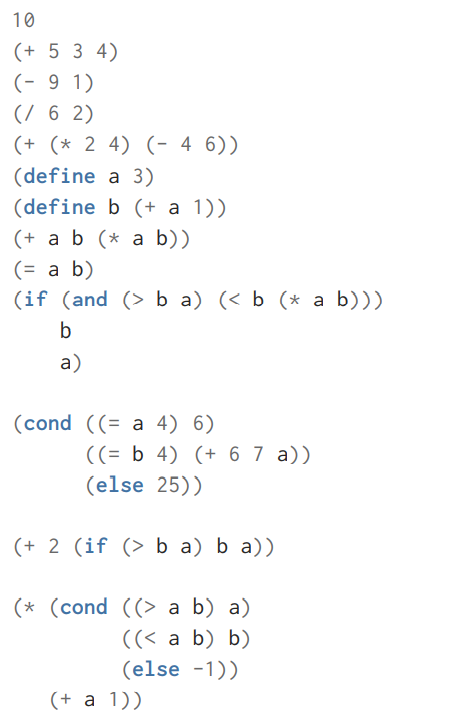
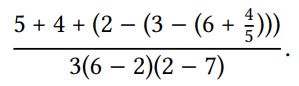

# Chapter 1 Building Abstractions with Procedures  

### Exercise 1.1  

Below is a sequence of expressions. What is the result printed by the interpreter in response to each expression? Assume that the sequence is to be evaluated in the order in which it is presented.  

  

```
> 10
10
> (+ 5 3 4)
12
> (- 9 1)
8
> (/ 6 2)
3
> (+ (* 2 4)(- 4 6))
6
> (define a 3)
> (define b (+ a 1))
> (+ a b (* a b))
19
> (= a b)
#f
> (if (and (> b a)(< b (* a b))) b a)
4
> (cond ((= a 4) 6)
        ((= b 4) (+ 6 7 a))
        (else 25))
16
> (+ 2 (if (> b a) b a))
6
> (* (cond ((> a b) a)
           ((< a b) b)
           (else -1))
     (+ a 1))
16
```

### Exercise 1.2  

Translate the following expression into prefix
form:  


```
> (/ (+ 5 4 (- 2 (- 3 (+ 6 (/ 4 5)))))
     (* 3 (- 6 2) (- 2 7)))
-37/150
```  

### Exercise 1.3  

Define a procedure that takes three numbers
as arguments and returns the sum of the squares of the two
larger numbers.  


define:
```
> (define (bigger x y)
     {if (> x y)
         x
         y})
    
    
> (define (smaller x y)
    (if (> x y)
        y
        x))
> (define (square x) (* x x))
> (define (sum-of-squares x y)
    (+ (square x) (square y)))
> (define (bigger-sum-of-squares x y z)
      (sum-of-squares (bigger x y)
                      (bigger (smaller x y) z)))
```
Test:  
```
> (bigger-sum-of-squares 0 2 2)
8
> (bigger-sum-of-squares 1 2 3)
13
> (bigger-sum-of-squares 10 10 10)
200
> (bigger-sum-of-squares 1 1 1)
2
```
